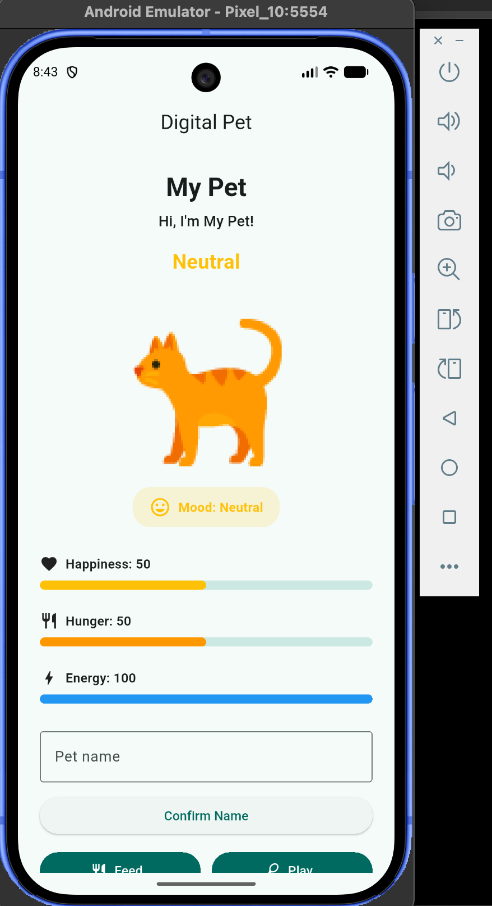
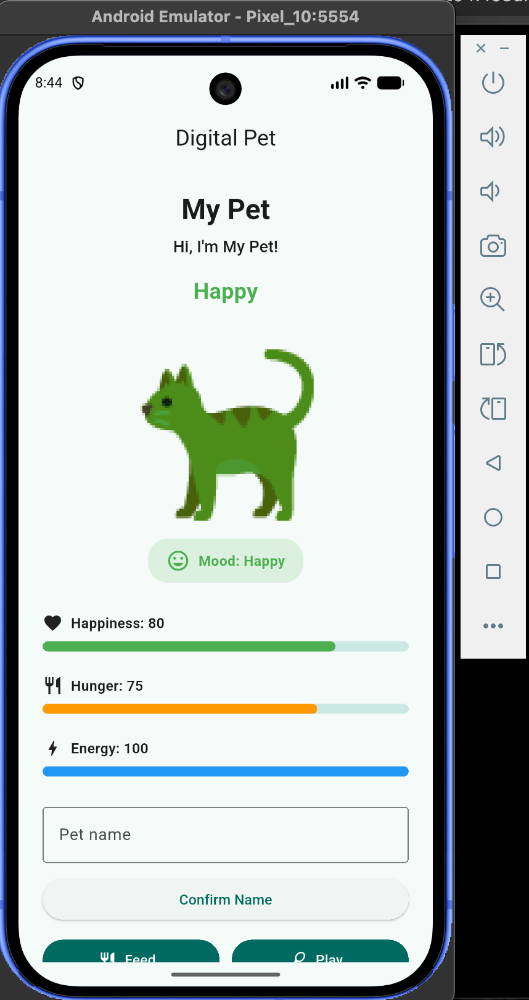
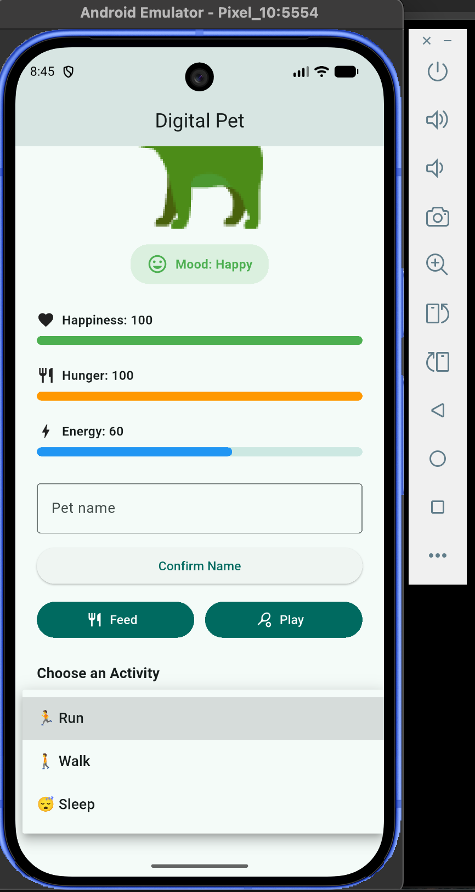

# Digital Pet State Lab

A Flutter digital pet application developed for **In-Class Activity 07 – Digital Pet State Lab**.

This project was developed collaboratively using one shared GitHub repository. Separate branches and pull requests were used for the Care Systems, Pet Personality, integration, graduate-level features, architecture, testing, and final documentation.

---

## Team Members

| Team | Student | Primary Responsibility |
| --- | --- | --- |
| **Team 1** | **Mouni Sri Nallapaneni** | Care Systems |
| **Team 2** | **Akshitha Sainath Sanagarapu** | Pet Personality |

Both team members collaborated on the final integration and graduate-level requirements through the shared repository and pull-request workflow.

---

## Team Responsibilities

### Team 1 – Care Systems

**Team Member:** Mouni Sri Nallapaneni

Team 1 implemented the core care-system behavior, including:

- Pet naming
- Feed, Play, and Reset actions
- Happiness and Hunger state
- Bounded meter values
- Automatic Hunger progression
- Game-over condition
- 3-minute high-happiness win condition
- Care-system state tests

Original branch:

`team-1/care-systems`

### Team 2 – Pet Personality

**Team Member:** Akshitha Sainath Sanagarapu

Team 2 implemented the pet's visual personality, interaction feedback, accessibility, and derived presentation behavior.

Implemented features include:

- Derived pet mood based on Happiness
- Derived pet speech based on game state
- Mood-based pet tint
- Mood-based pet scaling
- Animated Happiness and Hunger meters
- Feed and Play reaction feedback
- Pet bounce interaction animation
- Animated message transitions
- Reduced-motion support
- Semantic accessibility labels
- Transparent PNG pet asset
- `ColorFiltered` mood visualization
- Independently testable personality logic

Original branch:

`team-2/pet-personality`

---

## Graduate Pathway

The graduate implementation completes the full core application and includes three advanced feature areas:

1. **Energy System**
2. **Activity Selection**
3. **Visual Polish & Accessible Motion**

The graduate implementation also includes:

- Separation of pet/game rules from widget rendering
- Automated tests for state transitions
- Meter clamping tests
- Win and loss condition tests
- Reset behavior tests
- Architecture documentation
- Design decision and trade-off documentation
- Teammate pull-request reviews

---

## Advanced Feature 1 – Energy System

The application includes an **Energy** meter with a bounded range of `0–100`.

The initial Energy value is:

`100`

Energy is consumed by physical activities and restored through sleep.

The `PetGame` model clamps Energy to its valid range so that it cannot become negative or exceed 100.

### Energy Rules

- **Run** → consumes 20 Energy
- **Walk** → consumes 10 Energy
- **Sleep** → restores 30 Energy
- Energy is always clamped between `0` and `100`
- Run is blocked when the pet does not have enough Energy

---

## Advanced Feature 2 – Activity Selection

The application provides an activity selector with three activities:

- 🏃 Run
- 🚶 Walk
- 😴 Sleep

Each activity changes the pet's state according to defined game rules.

### Run

Run changes the state by:

- Energy: `-20`
- Happiness: `+20`
- Hunger: `+10`

Run requires at least 20 Energy.

### Walk

Walk changes the state by:

- Energy: `-10`
- Happiness: `+10`
- Hunger: `+5`

Walk requires sufficient Energy.

### Sleep

Sleep changes the state by:

- Energy: `+30`

Energy cannot exceed 100.

All meter changes are clamped to the valid `0–100` range.

---

## Advanced Feature 3 – Visual Polish & Accessible Motion

The application implements multiple visual and interaction-feedback effects as one advanced-feature bundle.

These include:

- Mood-based pet tint
- Mood-based pet scaling
- Animated meters
- Feed reaction feedback
- Play reaction feedback
- Pet bounce animation
- Animated message transitions
- Reduced-motion support

Animations respect the device's reduced-motion preference.

Mood is also communicated using text and accessibility semantics rather than color alone.

---

## Pet Mood Rules

The pet's mood is derived from its Happiness value.

| Happiness | Mood |
| --- | --- |
| `< 30` | Unhappy |
| `30–70` | Neutral |
| `> 70` | Happy |

Boundary behavior is explicitly tested at:

- 29 → Unhappy
- 30 → Neutral
- 70 → Neutral
- 71 → Happy

The pet also changes size according to its mood:

- **Unhappy** → slightly smaller
- **Neutral** → normal size
- **Happy** → slightly larger

---

## Derived Pet Messages

Pet speech is derived from the current game state rather than stored independently.

Examples include:

- Game over → `I need a rest.`
- Win → `Best day ever!`
- Hunger above 80 → `I'm starving!`
- Happiness at or below 30 → `Play with me?`
- Normal state → greeting using the pet's current name

Deriving these messages avoids storing duplicate presentation state that could become inconsistent with the actual game state.

---

## Core Care Rules

### Feed

Feed decreases Hunger by 10.

The Happiness effect depends on the resulting Hunger value:

- Normal feeding → Happiness increases by 10
- If resulting Hunger is below 30 → Happiness decreases by 20

### Play

Play:

- Increases Happiness by 15
- Increases Hunger by 5

### Automatic Hunger Progression

A periodic timer increases Hunger during gameplay.

Meter values remain bounded within their allowed range.

### Loss Condition

The loss condition is:

`Hunger == 100 && Happiness <= 10`

### Win Condition

The pet must maintain:

`Happiness > 80`

for three minutes.

Exactly 80 does **not** satisfy the high-happiness win requirement.

### Reset

Reset restores the pet to its initial game state.

Initial values are:

- Happiness: `50`
- Hunger: `50`
- Energy: `100`

---

## Graduate Architecture

The graduate pathway requires pet/game rules to be separated from widget rendering.

The final application separates responsibilities between the game model and Flutter UI.

### `lib/pet_game.dart`

`PetGame` owns the core game-state rules, including:

- Happiness
- Hunger
- Energy
- Meter clamping
- Feed behavior
- Play behavior
- Run behavior
- Walk behavior
- Sleep behavior
- State-transition rules
- Reset behavior
- Loss-state calculation
- High-happiness qualification

### `lib/main.dart`

The Flutter UI is responsible for:

- Rendering widgets
- Displaying current game state
- Pet naming UI
- Handling user interaction
- Animation
- Accessibility presentation
- Interaction feedback
- Timer lifecycle
- Calling the `PetGame` model when an action changes game state

This establishes a clear ownership boundary between **game rules** and **presentation/lifecycle behavior**.

---

## Architecture Design Decision and Trade-Off

### Design Decision

Core state-transition rules were moved into the `PetGame` model, while Flutter-specific rendering and lifecycle behavior remain in the stateful UI.

### Reason

Keeping game rules in `PetGame` makes state transitions independently testable without requiring the complete Flutter widget tree.

The UI can focus on:

- Presentation
- Animation
- Accessibility
- User input
- Flutter lifecycle management

### Trade-Off

Timer lifecycle behavior remains connected to the Flutter `State` object because timers must be created and cancelled safely through the widget lifecycle.

This means the application is not completely independent of the UI layer. However, keeping lifecycle-sensitive resources in the widget layer avoids unnecessary complexity while still separating the core game rules for testability.

---

## Accessibility

The interface includes accessibility support through Flutter semantics.

Examples include:

- Pet mood semantic description
- Happiness meter value description
- Hunger meter value description
- Energy meter value description
- Reduced-motion support
- Text labels in addition to visual mood feedback

Mood is therefore not communicated by color alone.

---

## Automated Testing

The project contains automated tests for the core game model, personality logic, and Flutter interface.

Test files include:

```text
test/
├── digital_pet_test.dart
├── pet_game_test.dart
├── pet_personality_test.dart
└── widget_test.dart
```

Automated testing covers:

- Initial state
- Feed state transitions
- Play state transitions
- Run state transitions
- Walk state transitions
- Sleep and Energy recovery
- Energy bounds
- Happiness bounds
- Hunger bounds
- Meter clamping
- Reset behavior
- Mood boundaries
- Personality logic
- Win qualification
- Loss condition
- Accessibility semantics
- Widget interaction behavior

### Verification Commands

```bash
flutter analyze
flutter test
```

Final verification during development produced:

```text
flutter analyze
No issues found!
```

and:

```text
flutter test
All tests passed!
```

---

## Manual Test Notes

The integrated application was manually tested for its primary user flows.

| Test | Expected Result |
| --- | --- |
| Launch application | Initial pet state appears correctly |
| Confirm pet name | Displayed pet name updates |
| Feed | Hunger decreases and feedback appears |
| Play | Happiness increases and Hunger increases |
| Run | Energy decreases; Happiness and Hunger update |
| Walk | Energy decreases; Happiness and Hunger update |
| Sleep | Energy increases without exceeding 100 |
| Repeated actions | Meter values remain between 0 and 100 |
| Run with insufficient Energy | Run is blocked |
| Reset | Initial game state is restored |
| Mood transition | Pet text, tint, and size respond to Happiness |
| Reduced motion | Animation behavior respects accessibility preference |

---

## Feature-to-Outcome Rubric Map

| Requirement / Feature | Implementation Evidence |
| --- | --- |
| Core state model | Happiness, Hunger, naming, Feed, Play, Reset |
| Automatic progression | Periodic Hunger timer |
| Bounded state | `PetGame` clamping logic and automated tests |
| Loss condition | `PetGame` loss-state logic and automated tests |
| Win qualification | High-Happiness rule and timer behavior |
| Energy System | Energy state, meter, Run/Walk/Sleep rules |
| Activity Selection | Run, Walk, and Sleep activity selector |
| Visual Polish | Mood tint, scaling, animated meters, interaction feedback |
| Accessible Motion | Reduced-motion handling |
| Accessibility | Semantic labels and text-based mood feedback |
| Graduate Architecture | `PetGame` separated from widget rendering |
| Graduate Testing | Model and widget automated tests |
| Design Justification | Architecture decision and trade-off documented above |
| Graduate PR Reviews | Akshitha reviewed PR #4; Mouni reviewed the final documentation/screenshots PR |

---

## Pull Requests and Collaboration

Development was completed using separate branches and pull requests.

### PR #1 – Team 2: Pet Personality and Visual Feedback

**Contributor:** Akshitha Sainath Sanagarapu

Team 2 implementation covering personality, visual feedback, animation, accessibility, and related tests.

https://github.com/MouniSri039/Digital_Pet/pull/1

### PR #2 – Team 1: Care Systems

**Contributor:** Mouni Sri Nallapaneni

Team 1 implementation covering the core care-system state and behavior.

https://github.com/MouniSri039/Digital_Pet/pull/2

### PR #3 – Team 1 + Team 2 Integration

Integration of the Team 1 care system with the Team 2 personality and visual-feedback implementation.

https://github.com/MouniSri039/Digital_Pet/pull/3

### PR #4 – Graduate Architecture, Energy System, and Activity Selection

Graduate architecture separation plus the Energy System, Run/Walk/Sleep activity selection, and additional automated tests.

https://github.com/MouniSri039/Digital_Pet/pull/4

---

## Graduate Pull Request Reviews

Both graduate team members completed the required teammate pull-request review.

### Akshitha Sainath Sanagarapu

**Akshitha Sainath Sanagarapu (`AkshithaSanagarapu`)** reviewed and approved **PR #4 – Graduate Architecture, Energy System, and Activity Selection** before it was merged into `main`.

The review covered:

- `PetGame` architecture separation
- Energy System
- Run/Walk/Sleep activity selection
- State transitions
- Meter clamping
- Reset behavior
- Win/loss logic
- Automated test coverage

Review evidence:

https://github.com/MouniSri039/Digital_Pet/pull/4

### Mouni Sri Nallapaneni

**Mouni Sri Nallapaneni** reviewed and approved Akshitha Sainath Sanagarapu's final documentation and screenshot pull request before it was merged into `main`.

The review covered:

- Final README documentation
- Team/member roles
- Graduate pathway evidence
- Feature-to-outcome rubric mapping
- Architecture and design trade-off documentation
- Final application screenshots
- Pull-request evidence
- Testing evidence

Review evidence:

https://github.com/MouniSri039/Digital_Pet/pull/FINAL_PR_NUMBER

---

## Project Structure

```text
lib/
├── main.dart
├── pet_game.dart
└── pet_personality.dart

test/
├── digital_pet_test.dart
├── pet_game_test.dart
├── pet_personality_test.dart
└── widget_test.dart

assets/
└── images/
    └── pet.png

docs/
└── screenshots/
    ├── initial_state.png
    ├── happy_state.png
    └── activity_energy.png
```

---

## Screenshots

### Initial / Neutral State

The initial state demonstrates the starting values of the integrated Digital Pet application:

- Happiness: 50
- Hunger: 50
- Energy: 100
- Mood: Neutral



### Happy Personality State

The Happy state demonstrates the derived personality behavior, including the green mood-based pet tint, Happy text state, mood feedback, and meter changes.



### Energy System and Activity Selection

The graduate advanced-feature implementation includes an Energy meter and the Run, Walk, and Sleep activity selector.

This screenshot demonstrates a reduced Energy value after activity and displays all three available activities.



---

## Setup, Build, and Test

### Clone the Repository

```bash
git clone https://github.com/MouniSri039/Digital_Pet.git
cd Digital_Pet
```

### Install Dependencies

```bash
flutter pub get
```

### Run the Application

```bash
flutter run
```

### Analyze the Project

```bash
flutter analyze
```

### Run Automated Tests

```bash
flutter test
```

### Build the Release APK

```bash
flutter build apk --release
```

The generated release APK can be found at:

```text
build/app/outputs/flutter-apk/app-release.apk
```

---

## Asset Information

The application uses the pet image located at:

`assets/images/pet.png`

The pet image was generated specifically for this Digital Pet coursework project and is used as the application's visual pet asset. It is not a third-party asset requiring external source attribution.

---

## Repository Hygiene

The repository contains:

- Flutter source code
- Required application assets
- Automated tests
- README documentation
- Rubric evidence screenshots

Generated build folders, local development artifacts, and secrets are not intended to be committed.

The release APK is submitted separately through iCollege unless otherwise requested by the instructor.

---

## Submission

Every student must individually submit the complete required package to the labeled iCollege folder for **In-Class Activity 07**.

### 1. `github_link.txt`

Contains the URL of the single combined GitHub repository.

### 2. `DigitalPet_TeamName.apk`

The shared final release APK:

- Built after all team work is merged
- Individually uploaded by every student
- Installed and launched before submission

### 3. `YourName_CriticalThinking.docx`

The individual reflection document:

- Contains the student's name and ID
- Contains answers to all 10 required reflection questions
- Is individually completed and uploaded by each student

### Final Verification

Before submission, each student should confirm:

- All three required files appear in the labeled iCollege folder.
- The GitHub repository link works for the instructor.
- The repository contains the complete Flutter source.
- The README contains the required rubric evidence.
- The submitted APK installs and launches successfully.